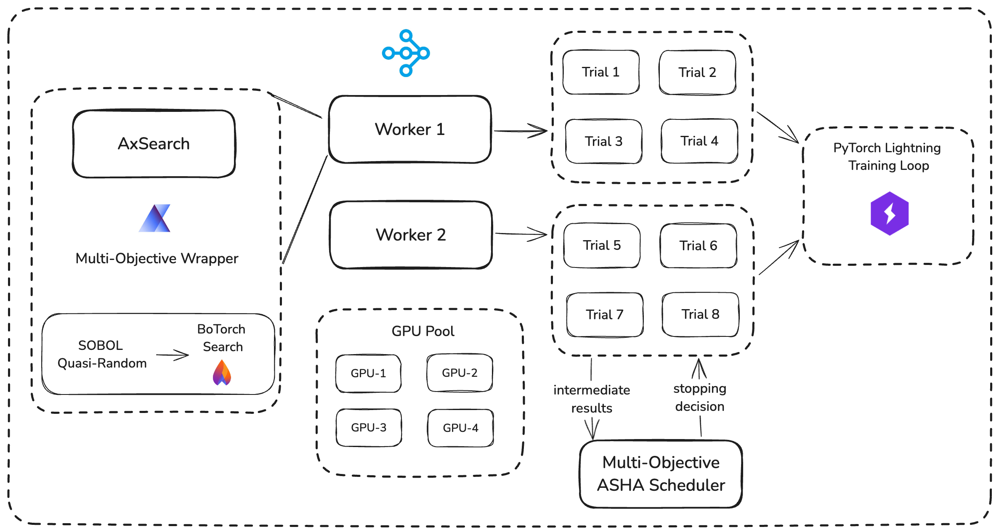

# Distributed, Multi-Objective Bayesian Optimisation using Ax, BoTorch, RayTune and PyTorch Lightning :rocket:

<p align="center">
Sidharrth Nagappan <br/>
University of Cambridge <br/>
sn666@cam.ac.uk
</p>

---
This work was done as part of the [Large-Scale Data Processing](https://www.cl.cam.ac.uk/~ey204/teaching/ACS/R244_2024_2025/index.html) course at the University of Cambridge. 


### Abstract

This project details, implements Multi-Objective Bayesian Optimisation using Ax and BoTorch, using RayTune as a distributed backbone. Notably, it is the first effort to integrate multi-objective BoTorch directly into Ray Tune via the Ax Service API, by modifying RayTune's `AxSearch` class to allow custom experiments and multiple objectives. It is also the first work to adapt RayTune's existing Hyperband schedulers -- such as the Asynchronous Successive Halving algorithm -- for multi-objective settings. The empirical results compare critical hyperparameters for these advanced multi-objective schedulers, and show that they can reduce runtime by up to 51\% while keeping the final hypervolume within 2\% of the first-in-first-out (FIFO) scheduling baselines on the University of Cambridge Department of Computer Science's GPU server across 5 GPUs. Hypervolumes and Pareto fronts of dual and triple-objective optimisation settings are also computationally compared and analysed. The complete source code -- encompassing custom search algorithms, schedulers and training scripts -- is made publicly available.



## How to Run

Runs are instantiated through the shell script `final_runs.sh` that in turn calls `ax_multiobjective.py`. 

```bash
sh final_runs.sh
```

Running a single multi-objective experiment for inversely competing accuracy and model size objectives:

```bash
CUDA_VISIBLE_DEVICES=0,1,2,3,6 python3 ax_multiobjective.py --num_samples 25 
--max_num_epochs 8 
--objective_1 ptl/val_accuracy 
--objective_1_type max --objective_1_threshold 0.90 --objective_2 ptl/model_params 
--objective_2_threshold 100000 
--objective_2_type min 
--max_concurrent 10 
--accelerator gpu 
--data_path /home/sn666/large-scale-data-processing/miniproject/data 
--use_scheduler 
--scheduler_max_t 8 
--scheduler_grace_period 2 
--scheduler_reduction_factor 6 
--remark 8e/moasha-epsnet/maxt8gr2red6/maxaccminparam --use_scaling_config 
--results_folder final_results_7jan | tee -a "$LOG_FILE"
```

## Acknowledgements

The ideas for this work were spawned from the following GitHub issues that began talking about multi-objective optimisation in RayTune:

1. https://github.com/ray-project/ray/issues/8018
2. https://github.com/ray-project/ray/issues/32534

Multi-Objective Asynchronous Successive Halving was inspired by the following paper: https://arxiv.org/pdf/2106.12639

## References

1. [Ax: Adaptive Experimentation Platform](https://ax.dev/)
2. [BoTorch: Bayesian Optimization in PyTorch](https://botorch.org/)
3. [RayTune: Scalable Hyperparameter Tuning](https://docs.ray.io/en/master/tune/index.html)
4. [PyTorch Lightning: The Keras for ML Researchers](https://www.pytorchlightning.ai/)
5. [Hyperband: A Novel Bandit-Based Approach to Hyperparameter Optimization](https://arxiv.org/abs/1603.06560)
6. [Asynchronous Successive Halving](https://arxiv.org/pdf/2106.12639)
7. [MO-HB: A Multi-Objective Successive Halving Algorithm](https://arxiv.org/pdf/2106.12639)

For any questions, please reach out to me at sn666[at]cam.ac.uk